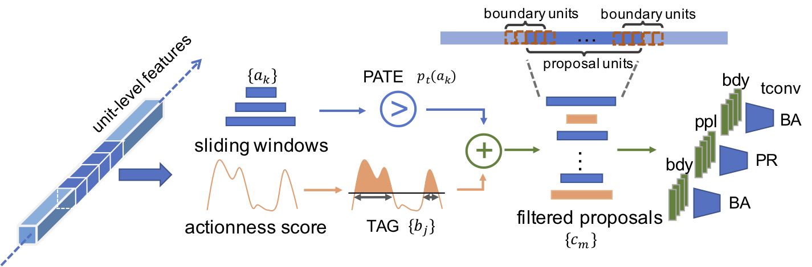

# CTAP
This repository contains tensorflow implementation for *CTAP: Complementary Temporal Action Proposal Generation* in [ECCV 2018](https://arxiv.org/pdf/1807.04821.pdf).

## Setup
The framework of CTAP is shown in the figure below:

<p align="center">
  
</p>

This repository mainly consists of two parts: 

* code for Temporal convolutional Adjustment and Ranking (TAR) network which uses temporal conv layers to aggregate the unit-level features ( in the folder `TAR`)
* code for Proposal-level Actionness Trustworthiness Estimator (PATE) classifier ( in the folder `PATE`)

## Feature downloading

We provide both unit-level features for [TAG](https://github.com/yjxiong/action-detection) scores prediction and sliding windows features for TAR on [THUMOS-14 dataset](http://crcv.ucf.edu/THUMOS14/). 

> Note: validation set is used for training, as the training set for THUMOS-14 does not contain untrimmed videos.

For unit-level features (unit length = 16), the appearance features can be downloaded at here: [val set](https://drive.google.com/file/d/180YUoPvyaF2Z_T9KMKINLdDQCZEg60Jb/view?usp=sharing), [test set](https://drive.google.com/file/d/1x9Q78AZiAGqx4XB2zO3SEKp1htsATlnU/view?usp=sharing); the denseflow features can be downloaded here: [val set](https://drive.google.com/file/d/1-6dmY_Uy-H19HxvfK_wUFQCYHmlPzwFx/view?usp=sharing), [test set](https://drive.google.com/file/d/1Qm9lIJQFm5s6hDSB_2k1tj8q2tnabflJ/view?usp=sharing).

For unit-level features (unit length = 6), the appearance and denseflow features for validation and test sets are available in [google drive](https://drive.google.com/file/d/1WAWLULgzqjyi5Z68_Yadn8DHuL594xL2/view?usp=sharing).

## Training & evaluating TAR

### Training
Download the unit level featurs, and edit the feature path in `TAR/main.py`, and then just run  `python main.py`. The `post_processing.py` in `TAR/test_results` folder should be applied on the output test result file. After post processing, the pkl file can be evaluated by the eval program, which can be found in [here](https://github.com/jiyanggao/TURN-TAP/tree/master/eval).

### Evaluation
Currently there are three sets of action proposals for testing with different purposes. To test different proposals, please modify `TAR/main.py` file in lines 181-185 respectively.

| line 185: `test_clip_path` | `test_swin.txt` | `tag_proposals_round6.txt` | `test_swin_unit6_sample4.txt` |
|----------------------|:---------------:|:--------------------------:|:-----------------------------:|
| Evaluated proposals  | sliding windows with unit length of 16 |  TAG proposals | sliding windows with unit length of 6 |

When line 185 is `test_swin.txt`, line 181-184 contents do not need modification. When line 185 becomes `tag_proposals_round6.txt` or `test_swin_unit6_sample4.txt`, please modify line 181-184 as the feature folders downloaded and unzipped from the link of unit-level features (unit length = 6) provided on the above.

## Reference

If you find the repository is useful for your research, please consider citing the following work:

```
@inproceedings{gao2018ctap,
  title={CTAP: Complementary Temporal Action Proposal Generation},
  author={Gao*, Jiyang and Chen*, Kan and Nevatia, Ram},
  booktitle={ECCV},
  year={2018}
}
```
